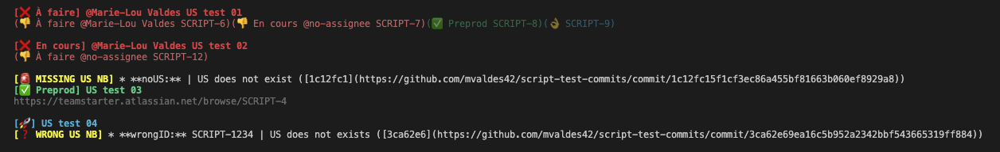
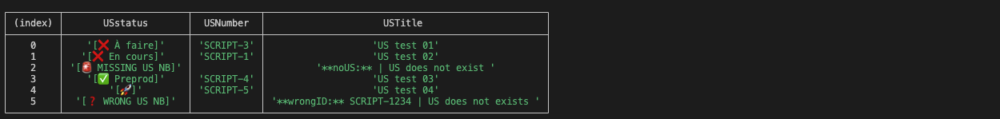

# jira-standard-version-release-check

A small tool to easily check if commits related to a User Story and their task is ready to be released in production for a scrum project.

## What can I do with check-release ?

The tools provided by this library will allow you to:

- Compare your commits titles to your Jira US status in order to quickly see if the US are done and reviewed
- Compare your commits titles to your Jira tasks status in order to quickly see if the tasks are done and reviewed

## Getting started

Add the lib and the peer dependencies:

```
$ yarn add @teamstarter/jira-standard-version-release-check
```

⚠️ Caution: check-release requires at least Node v9.11.2 or greater as it is using async/await.

### Setting up for versioning

Check-release uses [standard-version](https://www.npmjs.com/package/standard-version) to generate a changelog based on your commits.

- You need to have a "version" field in your package.json.
- Follow the [Conventional Commits Specification](http://www.conventionalcommits.org) in your repository.

### Setting up .env file

You need to add the following entries in your env or in a .env file located in the current folder. 
For all of the 'STATUS' in the env variable, you can set many of them, the script will compare env entries with US/tasks status with `includes()`. They are case insensitive.
⚠️ Caution: the Jira API uses the language set in the Jira app. Be mindful of that when setting the following Jira status values.

```
JIRA_ACCOUNT_TOKEN=
JIRA_ACCOUNT_EMAIL=
JIRA_US_READY_TO_RELEASE_STATUS=
JIRA_US_RELEASE_STATUS=
JIRA_TASK_READY_TO_RELEASE_STATUS=
JIRA_TASK_RELEASE_STATUS=
JIRA_SUBDOMAIN=
JIRA_PROJECT_KEY=
```

- `JIRA_ACCOUNT_TOKEN` is the token you have to [generate on your atlassian profile](https://support.atlassian.com/atlassian-account/docs/manage-api-tokens-for-your-atlassian-account/#Create-an-API-token).
- `JIRA_US_READY_TO_RELEASE_STATUS` is the status on Jira that you consider is "ready to release" for US.
- `JIRA_US_RELEASE_STATUS` is the status on Jira that you consider is "released" for US.
- `JIRA_TASK_READY_TO_RELEASE_STATUS` is the status on Jira that you consider is "ready to release" for tasks.
- `JIRA_TASK_RELEASE_STATUS` is the status on Jira that you consider is "released" for task.
- `JIRA_SUBDOMAIN` is the subdomain name of your organization when you connect on Jira (like so `<JIRA_SUBDOMAIN>.atlassian.net`)
- `JIRA_PROJECT_KEY` is the project key on Jira (which is typically the shorthand version of the project's name)

### Setting up your git commits

Make sure that the commits must contain the US id, like so : `<project-key>-<US number>`

## How to use

You can run the library with the cli command: `check-release`

### Available options

You can apply the following options :

```
--onlyWarnings or -w : will only show warnings.
--table or -t : will display output as a table (see console.table())
--disableChecks or -d : will only display standard-version output without comparing it to Jira.
```

You can combine onlyWarnings mode with table mode.

## Understand the output

### Error types

You might encounter the following errors:

    - [🚨 MISSING US NB] => Your commit does not contain a correct US number, refer to the section about Setting up your git commits
    - [🔥 ERROR DURING FETCH] => The fetch to the Jira API returned an error.
    - [❓ WRONG US NB] => Your commit contains a US number that does not exists.

### Status types for US

    - 🚀 => US status = JIRA_US_RELEASE_STATUS.
    - ✅ => US status = JIRA_US_READY_TO_RELEASE_STATUS.
    - ❌ => US status isn't any of the above.

### Status types for tasks

    - 👌 => task status = JIRA_TASK_RELEASE_STATUS.
    - ✅ => task status = JIRA_TASK_READY_TO_RELEASE_STATUS.
    - 👎 => task status isn't any of the above.

### Output formatting

```
[<US STATUS EMOJI> <US STATUS (if not in prod)>] @<ASSIGNEE (if is not ready)> <US TITLE>]
< List of tasks (if not in prod):
(<task status emoji> <task title> @<assignee (if is not ready)> <task key>)
>
<Link to US (if ready)>
```

```
┌─────────┬──────────────────────┬──────────┬────────────────┐
│ (index) │       USstatus       │ USNumber │   USTitle      │
├─────────┼──────────────────────┼──────────┼───────────────-┤
└─────────┴──────────────────────┴──────────┴────────────────┘
```
